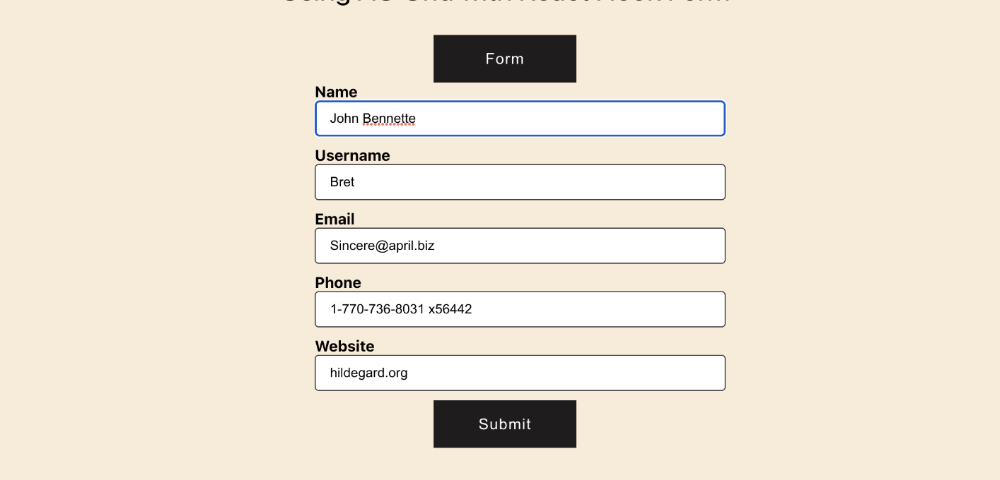
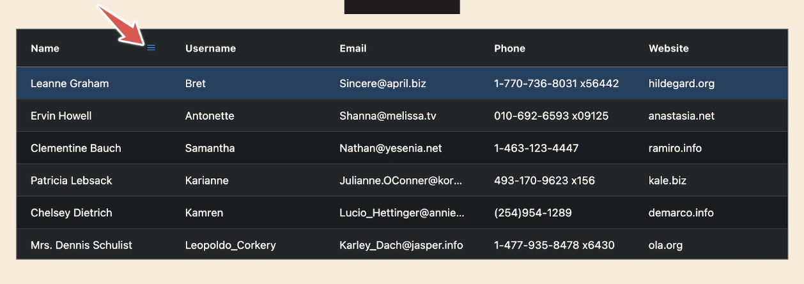

# Frontend and Backend tasks

Create a minimalist application for managing users in system

Key Features:

- Create user: add new users to the system
- Remove User: delete user by unique ID
- Update Info: edit user details

---

## Frontend task

### Setting up the project structure and checking library documentation

- Create a boilerplate application using  [create-react-app](https://create-react-app.dev/) use TypeScript version
- Check [redux](https://redux.js.org/) and review the library documentation and strive to comprehend the issues it aims
  to address
- Add [redux-toolkit](https://redux-toolkit.js.org/) a helper to the project for working with state management
- Add [ag-grid](https://ag-grid.com/react-data-grid/getting-started/) library as a dependency

### Frontend task I: create user form page



### Frontend task II: create the user list component using ag-grid



---

## Backed task

### Setting up the project structure and checking library documentation

- Check CherryPy HTTP framework, documentation link [cherrypy](https://docs.cherrypy.dev/en/latest/)
- Create a basic "hello world" application using the CherryPy HTTP framework
- Check REST API Best practice documentation [REST API](https://restfulapi.net/resource-naming/)

### Backend task I: Prepare data model schema for the ```User``` entity

Example:

```
User: [id, ...]
```

### Backend task II: Develop REST API methods for managing ```User``` data models

```
Create User:
Method: POST
Endpoint: /users
Description: Create a new user.
Request Body: JSON containing user data (name, email, phone and etc).
Response: JSON with the created user's details or an error message.

Get User:
Method: GET
Endpoint: /users/{userId}
Description: Retrieve user details by ID
Response: JSON containing user details if found, or an error message if not found.

Update User:
Method: PUT
Endpoint: /users/{userId}
Description: Update user details by ID
Request Body: JSON containing updated user data
Response: JSON with the updated user's details or an error message

Delete User:
Method: DELETE
Endpoint: /users/{userId}
Description: Delete user by ID
Response: JSON confirming the deletion or an error message.
```


